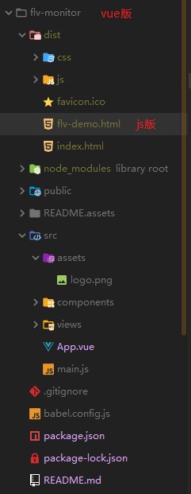
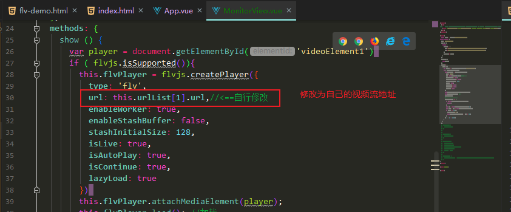

# flv-monitor

## Project setup
```
npm install
```

### Compiles and hot-reloads for development
```
npm run serve
```

### Compiles and minifies for production
```
npm run build
```

### Run your tests
```
npm run test
```

### Lints and fixes files
```
npm run lint
```

### Customize configuration
See [Configuration Reference](https://cli.vuejs.org/config/).

### 时序图


### 流程

后端通过onvif协议发现设备,获取到的设备信息存在数据库中 ,前端请求设备列表 ,后端数据库查询返回.需要播放时,向后端发送请求,获取到 视频流地址(http开头),前端通过flv.js插件创建一个视频对象,把该视频通过video标签加载.

直播设备它的视频流如果是rtsp流,后端需要通过FFmpeg转成rtmp流(这个FFmpeg转码命令百度上搜一大堆,本人是前端,这方面不太清楚),因为前端是无法渲染rtsp视频流(vlc插件可以,但已经不支持主流浏览器了,目前只支持IE,而且bug奇多).转成rtmp流的视频格式为flv,前端可以借助flash渲染,相关插件有video.js,因为本人项目不想借助任何浏览器插件如flash,同时flash谷歌浏览器将会在2020年底移除,遂使用B站开源框架flv.js.

后端把原本rtmp开头的视频流地址 转成 http开头的地址 ,推流到Nginx,前端从Nginx取流

### 项目





自行修改为自己的视频流地址